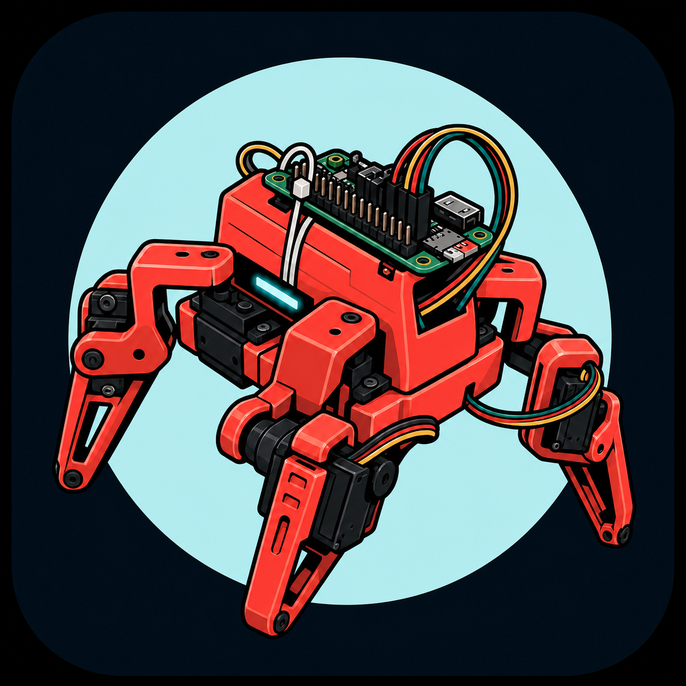
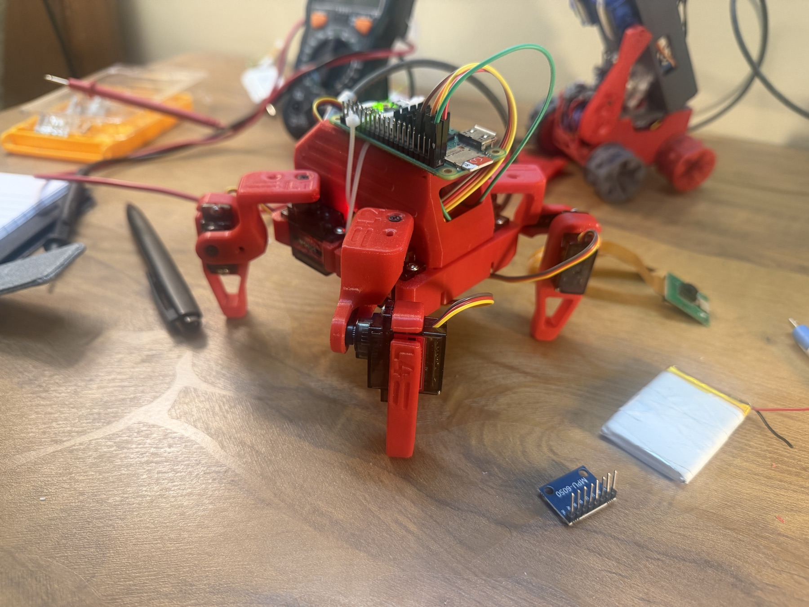
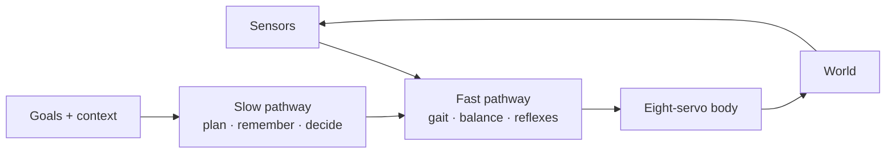
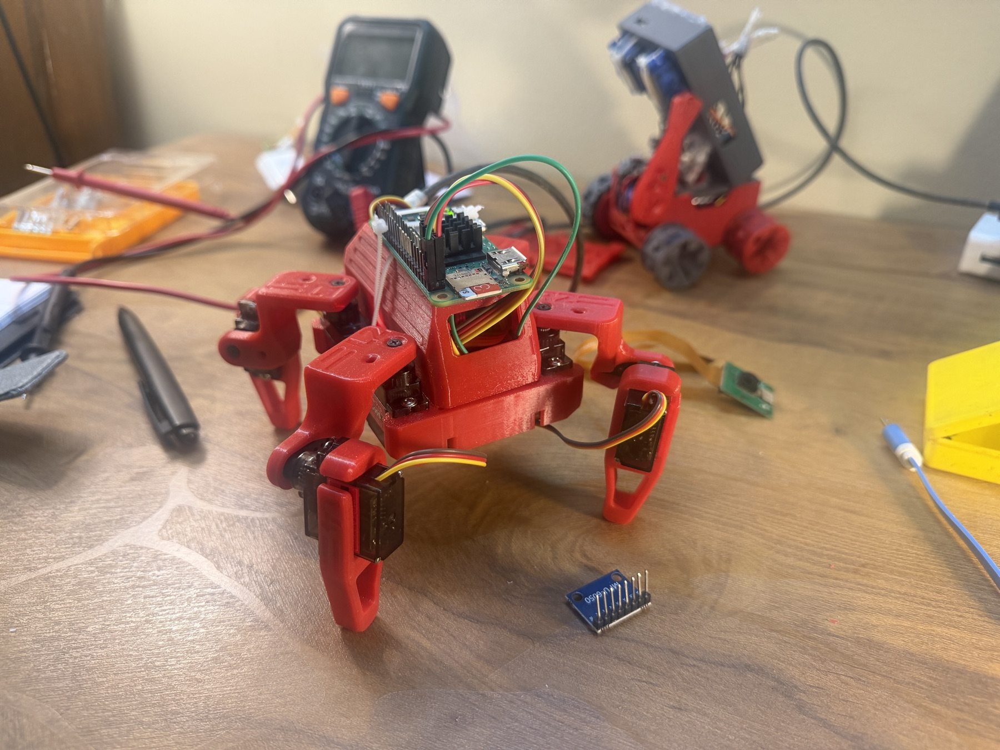

<p align="center">
  <a href="https://molty.pet">
    
  </a>
</p>

<h1 align="center">Molty</h1>

<p align="center"><strong>Build a robot pet. Give your AI a body.</strong></p>

<p align="center">
  An open Raspberry Pi robot pet you assemble yourself.<br>
  The prototype walks today; an interruptible OpenAI voice agent is now being tested.
</p>

<p align="center">
  <a href="https://molty.pet"></a>
  <a href="https://github.com/Jovian-Dsouza/molty.pet/issues"></a>
  <a href="./LICENSE"></a>
</p>

<p align="center">
  <a href="https://molty.pet">
    
  </a>
</p>

Molty is an active, build-in-public robotics experiment—not a finished consumer product. The physical prototype has a 3D-printed quadruped body, eight servos, and a Raspberry Pi. The repository currently contains the project website and a working MuJoCo/Gymnasium environment for locomotion experiments and PPO training.

The long-term idea is simple: movement should not wait for language. A fast pathway keeps the body responsive while a slower pathway decides what Molty should do and why.


```mermaid
flowchart LR
    S["Sensors"] --> F["Fast pathway<br/>gait · balance · reflexes"]
    G["Goals + context"] --> T["Slow pathway<br/>plan · remember · decide"]
    T --> F
    F --> B["Eight-servo body"]
    B --> W["World"]
    W --> S
```

## What is here today

| Area | Status | Where to look |
| --- | --- | --- |
| Physical prototype | Walking, waving, and dancing; hardware is still changing | [Build log on X](https://x.com/DsouzaJovian/status/2078107900359356547) |
| Voice agent | LiveKit/OpenAI vertical slice with local wake word, session context, and safe motion RPCs | [`firmware/`](./firmware) |
| Motion simulation | Eight-actuator MuJoCo model, Gymnasium environment, scripted showcase, and PPO trainer | [`simulation/`](./simulation) |
| Project website | Next.js site with the Build → Bond → Connect story, architecture, prototype footage, and roadmap | [`website/`](./website) · [molty.pet](https://molty.pet) |

> [!NOTE]
> The simulation model uses approximate dimensions, masses, joint limits, and optimistic servo force. It is useful for experiments, but it is not yet a calibrated digital twin of the physical robot.

## Hardware

The physical robot is inspired by a 3D-printed quadruped body built by [dorianborian/sesame-robot](https://github.com/dorianborian/sesame-robot) — check out the full hardware details there.

## See Molty move

<table>
  <tr>
    <td width="50%"></td>
    <td width="50%"></td>
  </tr>
</table>

Watch the latest [prototype playlist](https://x.com/DsouzaJovian/status/2078107900359356547) for real hardware progress, or run the local simulation below.

## Quick start

### Run the voice and motion dry run

The voice runtime is dry-run by default and will not touch the servos. See the
[firmware guide](./firmware/README.md) for LiveKit/OpenAI setup, wake-word
testing, calibration, and the first physical `wave`.

### Run the simulation

You will need [Python 3.12](https://www.python.org/downloads/) and [uv](https://docs.astral.sh/uv/).

```bash
cd simulation
uv sync
uv run python quadruped_demo.py
```

The interactive showcase walks, settles, jumps, and recovers. To validate the environment without opening a window:

```bash
uv run python quadruped_demo.py \
  --headless \
  --controller showcase \
  --duration 12
```

To start a four-environment PPO training run:

```bash
uv run python train_quadruped.py --timesteps 200000 --num-envs 4
```

See the [simulation guide](./simulation/README.md) for controllers, observations, rewards, and the short training smoke test.

### Run the website

You will need Node.js 20.9+ and npm.

```bash
cd website
npm ci
npm run dev
```

Open [http://localhost:3000](http://localhost:3000). Before submitting website changes, run:

```bash
npx eslint app
npm run build
```

## Repository map

```text
molty.pet/
├── firmware/                # Servo actions, safe executor, and voice runtime
│   ├── molty/
│   └── tests/
├── simulation/              # MuJoCo model, Gymnasium env, demos, and PPO training
│   ├── models/
│   │   └── molty_quadruped.xml
│   ├── quadruped_env.py
│   ├── quadruped_demo.py
│   └── train_quadruped.py
└── website/                 # Next.js project site and prototype media
    ├── app/
    └── public/
```

## Help Molty grow up

Molty is early enough that thoughtful contributors can still shape the fundamentals. Good contribution areas include:

- **Motion and learning** — reward design, terrain randomization, sensors, policies, evaluation, and sim-to-real work.
- **Hardware** — measured dimensions and torque, calibration tools, wiring docs, bill of materials, CAD, and safer mechanical designs.
- **Embodied intelligence** — interfaces between high-level plans and motion skills, memory, voice, perception, and safety boundaries.
- **Developer experience** — tests, reproducible experiments, telemetry, benchmarks, and clearer setup documentation.
- **Storytelling** — accessible robotics explanations, diagrams, website polish, video, and build-log documentation.

### Contribution workflow

1. Browse the [open issues](https://github.com/Jovian-Dsouza/molty.pet/issues) or open a small proposal before starting a large change.
2. Keep pull requests focused and explain the behavior or experiment being changed.
3. Include evidence: a headless simulation result, training metric, test, screenshot, or short clip—whatever fits the change.
4. Call out assumptions about the physical robot. Approximate simulation parameters should stay clearly labeled.

New to robotics or reinforcement learning? Documentation fixes, reproducible bug reports, small visualizations, and isolated simulation experiments are excellent first contributions.

## Roadmap

- **Build — building now:** affordable parts, documented assembly, stable walking, and repairable hardware.
- **Bond — next:** voice, memory, routines, and expressive movement grounded in what Molty can sense and do.
- **Connect — early experiments:** turn meaningful agent events into movement, sound, attention, and shared rituals.

## License

This is a **source-available, noncommercial** project licensed under the [PolyForm Noncommercial License 1.0.0](./LICENSE). You may study, modify, and redistribute it for permitted noncommercial purposes. Commercial use requires prior written permission from [Jovian Dsouza](https://x.com/DsouzaJovian).

Contributions are accepted under the same license unless agreed otherwise in writing. Third-party dependencies and materials remain subject to their own licenses and notices.

---

<p align="center">
  Built in public by <a href="https://x.com/DsouzaJovian">Jovian Dsouza</a>.<br>
  Follow <a href="https://x.com/moltypet">@moltypet</a> for build releases and prototype progress.
</p>
